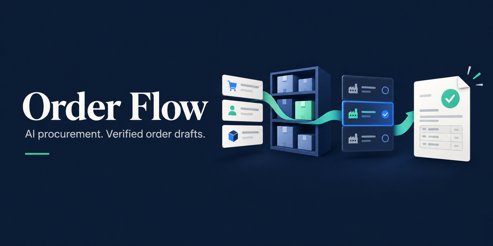

<div align="center">

# Order Flow — AI Procurement & Order Automation



### Customer orders in. Verified procurement drafts out.

An open-source **Codex skill for AI procurement and order automation**. Reconcile inventory, compare suppliers and prepare verified purchase-order drafts from customer orders and bills of materials.

[](LICENSE)
[](SKILL.md)
[](SKILL.md)

[Get started](#get-started) · [Read the skill](SKILL.md) · [Configure your business](references/company-setup.md) · [Automation guide](references/automation.md)

</div>

---

## From manual purchasing to a repeatable order flow

Order Flow guides an AI agent through the preparation work between incoming customer orders and supplier purchasing. It reads the scoped orders, applies product requirements, allocates available stock, compares approved suppliers and prepares traceable carts or purchase-order drafts.

**This repository contains an agent instruction package and setup guides.** The agent uses tools and accounts available in your environment. It does not ship an ERP connector, background service, scheduler or checkout bot.

## What it helps automate

| Stage | Outcome |
|---|---|
| **Order intake** | A complete, scoped batch with variants, overrides and deadlines. |
| **Demand planning** | Item/BOM requirements linked back to each customer order. |
| **Inventory reconciliation** | Shared stock allocated once; shortages and unknowns made explicit. |
| **Supplier selection** | Suitable supply compared on quantity, delivery and landed cost. |
| **Draft preparation** | Verified supplier carts or purchase-order drafts without duplicate additions. |
| **Review and recovery** | Saved state, exception reporting and an auditable handoff. |

Useful for retailers, assemblers, workshops and small manufacturers whose order requirements and stock are accessible through their configured systems.

| Business workflow | Start here |
|---|---|
| **Ecommerce order management** | Turn scoped sales orders into procurement requirements with [a company profile](examples/company-profile.example.yaml). |
| **Inventory reconciliation and BOM purchasing** | Allocate available stock and calculate component shortages with [the setup example](references/company-setup.md#validate-with-a-small-representative-batch). |
| **Repeatable procurement automation** | Connect an existing executor with checkpoints and recovery using [the automation guide](references/automation.md). |


## Get started

### 1. Install the skill

With Git and Codex available, clone into the personal skills directory. If `order-flow` already exists, compare the existing installation before updating it.

**Windows · PowerShell**

```powershell
git clone https://github.com/byensitmagnus/order-flow-skill.git "$env:USERPROFILE\.codex\skills\order-flow"
```

**macOS / Linux**

```bash
git clone https://github.com/byensitmagnus/order-flow-skill.git "$HOME/.codex/skills/order-flow"
```

If you use a custom `CODEX_HOME`, use its `skills` directory. Open a new Codex session and invoke `$order-flow`. Other skill-capable agents may adapt the instructions to their own tool and installation conventions; compatibility is not claimed as tested.

### 2. Configure your business

Copy [the example company profile](examples/company-profile.example.yaml) to a **private workspace** as `company-profile.yaml`. Specify your order source, inventory/BOM sources, suppliers, currency and authorized actions.

Provide supported connectors/APIs or authorized browser sessions for those systems. Start with preparation only and a small representative batch. The [setup guide](references/company-setup.md) explains what must be verified before relying on connected automation.

### 3. Run a scoped batch

> Use $order-flow with our private company profile. Process customer orders currently marked Processing for the specified date range. Allocate usable stock, calculate shortages, compare our approved suppliers and prepare carts or purchase-order drafts. Save the allocation ledger and report exceptions. Do not submit purchases or change source order statuses.

### 4. Add repeatable execution when needed

> Use $order-flow to map our existing scheduler to this preparation workflow. Define a stable run scope, persistent checkpoints, duplicate prevention and an exception review step. Identify any missing connectors before enabling the schedule.

The [automation guide](references/automation.md) covers triggers, retries, shared-stock allocation and approval boundaries. Enabling a schedule requires an explicit task and an available executor; installing this skill does not start recurring work.

## Example: buy the shortage, not the whole order

Two customer orders require six units of the same item. Three usable units are available and allocated once. Procurement demand is **three units**. If the supplier sells packs of two, prepare **two packs**, allocating three units to demand and recording one surplus unit.

The ledger preserves the customer-order allocations as well as the supplier pack quantity. A retry reconciles what is already saved rather than adding another two packs.

## Operating principles

- **Requirements before price.** Preserve promised specifications, pack contents, condition and permitted substitutions.
- **Actual state before retries.** Verify persisted destination quantities and submission status after ambiguous responses.
- **Landed cost before headline price.** Include freight, fees, currency and actual tax treatment.
- **Explicit authority before execution.** Preparation does not authorize payment, purchase submission, supplier messages, inventory reservations or source-system updates.
- **Private business data stays private.** Keep credentials, customer data, live quotes, completed company profiles and runtime ledgers outside this repo.

Prepared drafts and confirmed purchases are different states. Missing stock, incompatible products, uncertain delivery and missing integrations are reported as exceptions.

## Frequently asked questions

### What is an AI procurement skill?

An instruction package that helps a tool-enabled AI agent follow a procurement workflow: read orders, allocate stock, compare suitable suppliers, prepare drafts and verify saved results. Order Flow provides those instructions and setup examples.

### Can it automate WooCommerce or ERP purchase orders?

It can guide preparation when your agent has supported access to the required commerce, inventory and purchasing systems. You must configure those connections; this repo does not include a WooCommerce plugin or an ERP adapter.

### Does it place orders automatically?

The default workflow prepares carts or purchase-order drafts for review. Purchase submission requires explicit authorization and the executor's approval rules. Installing the skill does not schedule runs or make purchases.

### How does it avoid duplicate purchases?

The workflow records allocations and saved destination quantities. On a rerun it reconciles the actual state and applies the difference; an ambiguous submission must be resolved before retrying. A connected executor must provide persistence and concurrency control.

### Is this an inventory management system?

No. It uses the company's inventory records to calculate procurement requirements. Inventory reservations, stock updates and source order changes are separate actions that need authorized system access.

## Repository map

```text
order-flow-skill/
├── SKILL.md                         # Core agent workflow
├── agents/openai.yaml               # Codex display metadata
├── assets/                          # README banner and social preview
├── examples/
│   └── company-profile.example.yaml # Fictional configuration template
├── references/
│   ├── company-setup.md             # Sources, units and setup acceptance
│   ├── automation.md                # Scheduling, checkpoints and recovery
│   └── suppliers.md                 # Optional PC / DCS / Proshop example
├── README.md
├── LICENSE
└── .gitignore
```

The hardware supplier notes are a dated example, not required suppliers or universal purchasing rules. The public workflow has no company-specific brand preference or blanket substitution permission.

## Design references and reuse

The workflow fits existing procurement records rather than replacing an ERP. [ERPNext's procurement cycle](https://docs.frappe.io/erpnext/procurement-cycle-overview) provides a reference for material requests, quotations and purchase orders. [n8n's human review for AI tools](https://docs.n8n.io/advanced-ai/human-in-the-loop-tools/) provides a reference for approval points in an existing orchestrator.

These references informed the integration guidance. Neither platform is bundled or tested here; no implementation code is copied. Check the chosen platform's capabilities, maintenance and license for your own deployment.

## Contributing

Open an [issue](https://github.com/byensitmagnus/order-flow-skill/issues) or pull request with an anonymized scenario and the expected result. Improvements should preserve traceability, actual saved-quantity checks and execution authority. Never attach customer data, credentials or private cart links.

## License

[MIT](LICENSE). Use and adapt the skill for your business under the license terms. Third-party systems retain their own licenses and terms. This project is not affiliated with the suppliers or platforms used as examples.
