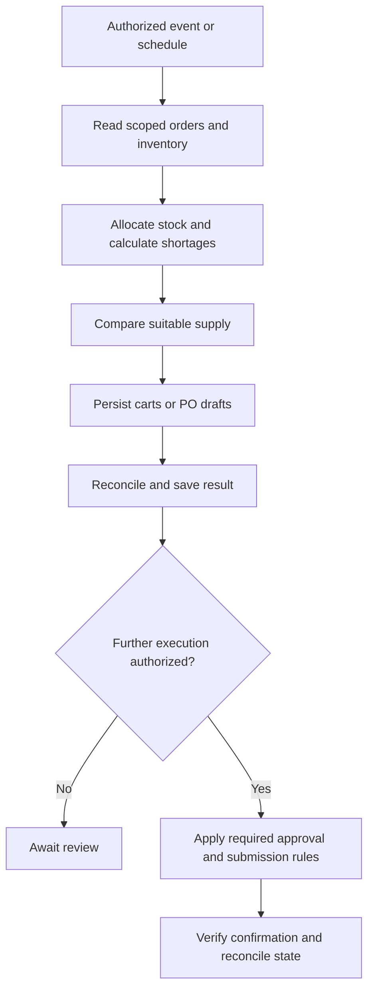

# Automation and recovery

Read this for repeated runs, scheduling, event triggers or authorized execution beyond preparation. This repository does not provide a scheduler, webhook receiver, ERP adapter or purchasing service.

## Fit the existing business workflow

Before enabling a schedule, identify its existing executor, stable source scope, persistent state location and supported tools. Define who approves exceptions and which destination may receive notifications. Authorization for one batch does not establish recurring purchasing or messaging authority.

## Make reruns safe

1. Give each run a stable identity based on company, source, warehouse and fixed scope. Retain exact included order IDs and source revisions so changes are distinguishable from retries.
2. Persist checkpoints after confirmed mutations. Track desired quantity, actual saved quantity and destination identifiers; update the difference rather than adding the full demand again.
3. Serialize writers that share inventory allocations, carts or drafts. Use the existing executor's locking/deduplication mechanism when available. Do not claim race-safe execution if none exists.
4. On an ambiguous response, query the destination first. If a purchase may have been submitted, find its confirmation/document identifier before any retry. An unavailable destination is an unresolved state, not permission to resubmit.
5. Before authorized submission, refresh changed source demand, stock and expired quotes. If quantities, supplier, price or delivery materially exceed the authorized scope, obtain the required decision.

Suggested ledger states: `planned`, `prepared`, `awaiting_review`, `submitted`, `confirmed`, `exception`. These are local workflow labels, not automatic edits to the source system.

## Reuse platforms rather than duplicate them

- [ERPNext procurement cycle](https://docs.frappe.io/erpnext/procurement-cycle-overview) documents a material-request → quotation → purchase-order flow. Map the skill to existing business records when the company already uses those capabilities.
- [n8n human review for AI tools](https://docs.n8n.io/advanced-ai/human-in-the-loop-tools/) documents approval points for tool execution. Use the host's supported approval mechanism when connecting an agent to an existing orchestrator.

These are design references, not bundled or tested integrations. No code from these projects is copied. Check the chosen platform's current features, maintenance and license before integrating; the skill's MIT license does not cover third-party runtimes.

## Evidence and notifications

Log completed actions from authoritative destination responses, not attempted calls. Save an exception summary for missing inventory, incompatible items, expired quotes or uncertain delivery. Keep live data private. Notify only the explicitly authorized recipients through the configured channel; scheduled execution does not itself authorize outbound messages.
